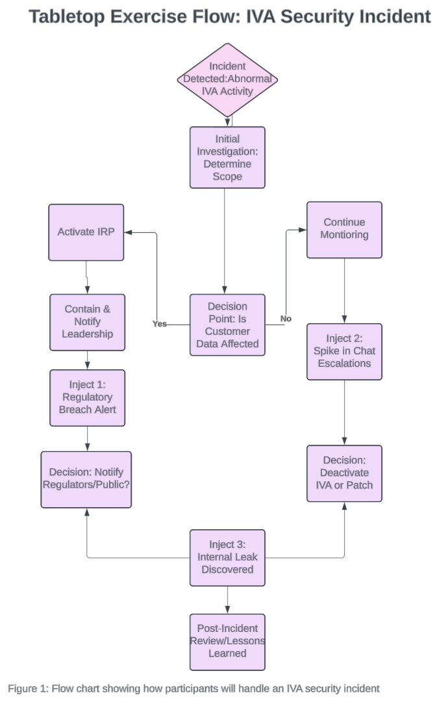

# Incident Response Tabletop Exercise

## Overview

This project demonstrates an incident response tabletop exercise used to evaluate response procedures during a cybersecurity incident.

## Objectives

* Review incident response workflows
* Identify stakeholder responsibilities
* Practice escalation procedures
* Evaluate communication processes

## Tools Used

* Incident Response Planning
* Security Operations Concepts

## Skills Demonstrated

* Incident Response
* Security Operations
* Risk Management
* Escalation Procedures
* Security Governance
## Project Documentation

### Incident Response Tabletop Exercise

