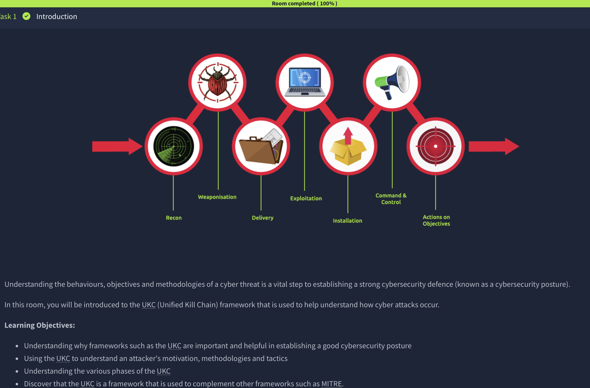
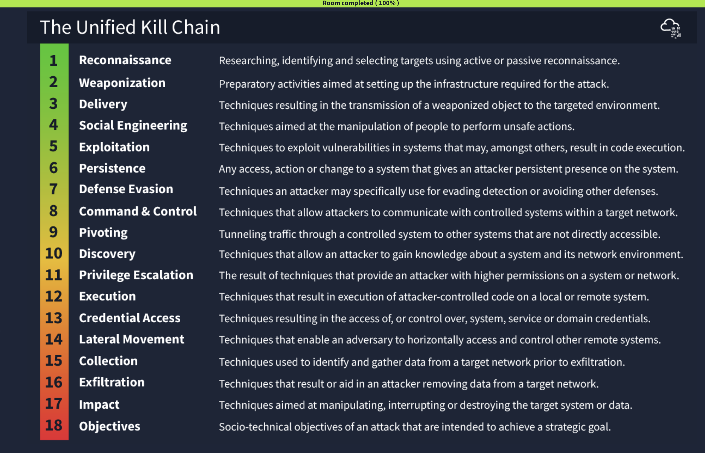
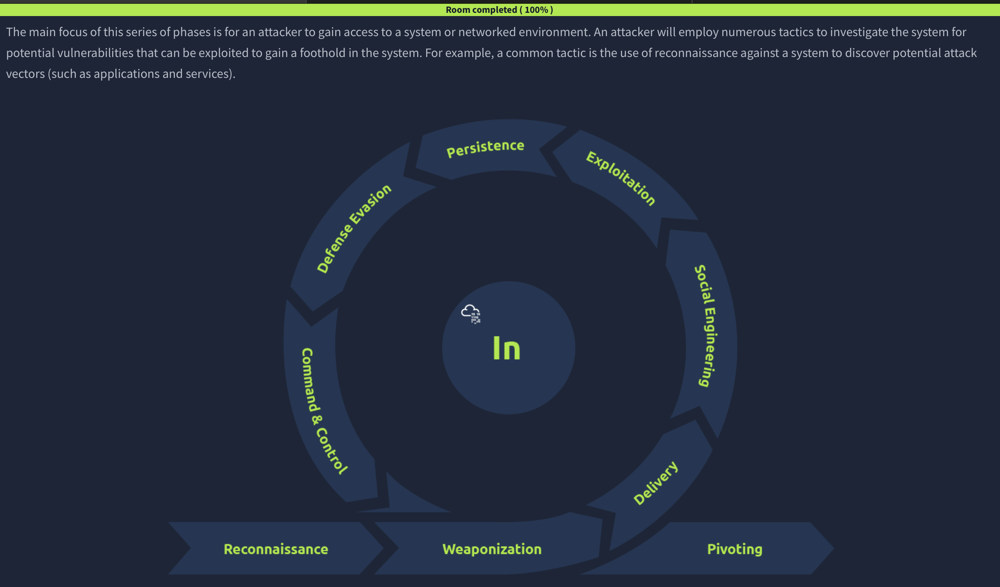
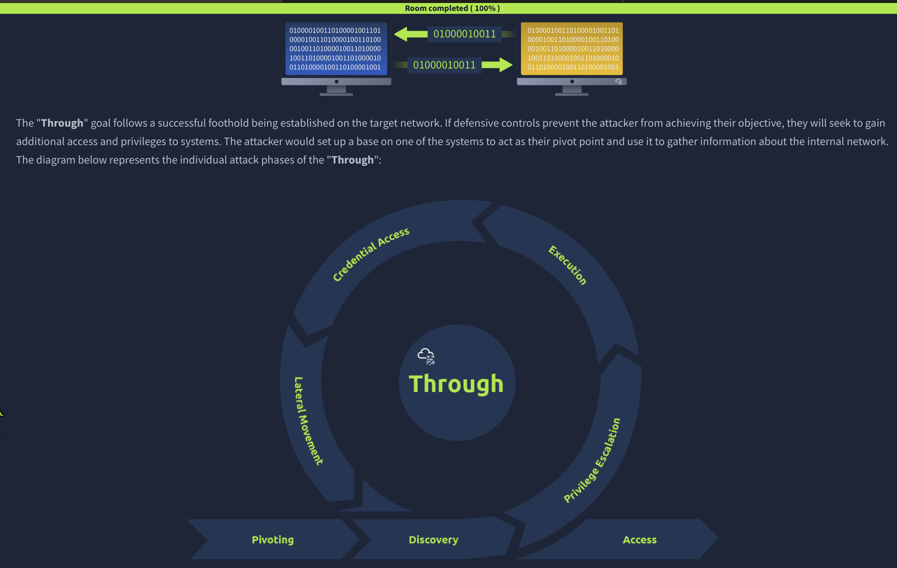
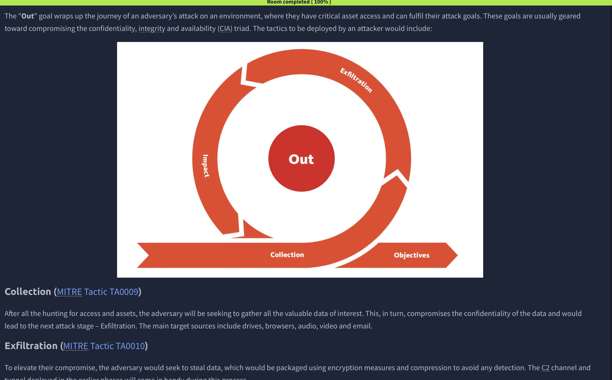

# Unified Kill Chain

## Overview

This TryHackMe room introduced the Unified Kill Chain framework and explained how it extends traditional cyber kill chain concepts to cover the full lifecycle of modern cyber attacks.

## Skills Demonstrated

- Unified Kill Chain fundamentals
- Attack lifecycle analysis
- Adversary behavior tracking
- Intrusion phase identification
- Detection opportunities
- Threat hunting concepts

## Screenshots
## Screenshots

### Introduction

### Unified Kill Chain Framework

### Foothold Phase

### Through Goal Phase

### Actions on Objectives

